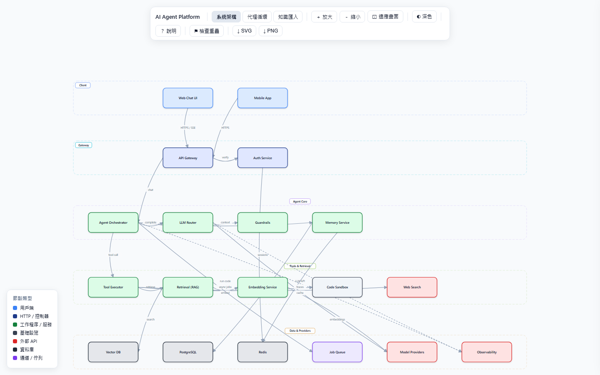
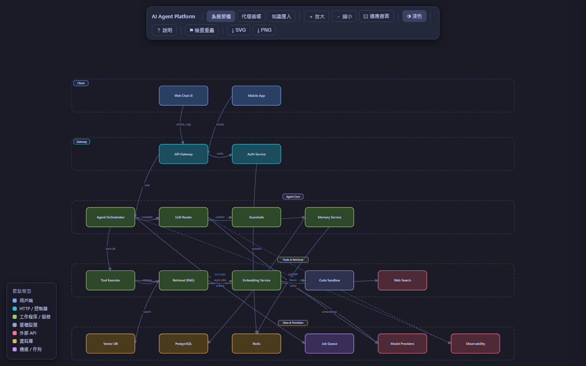
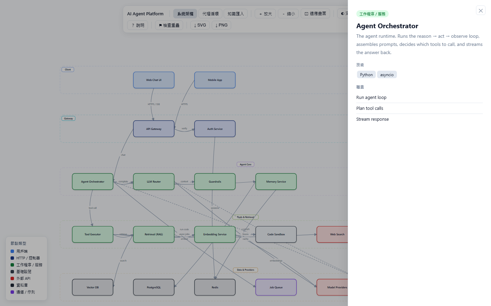
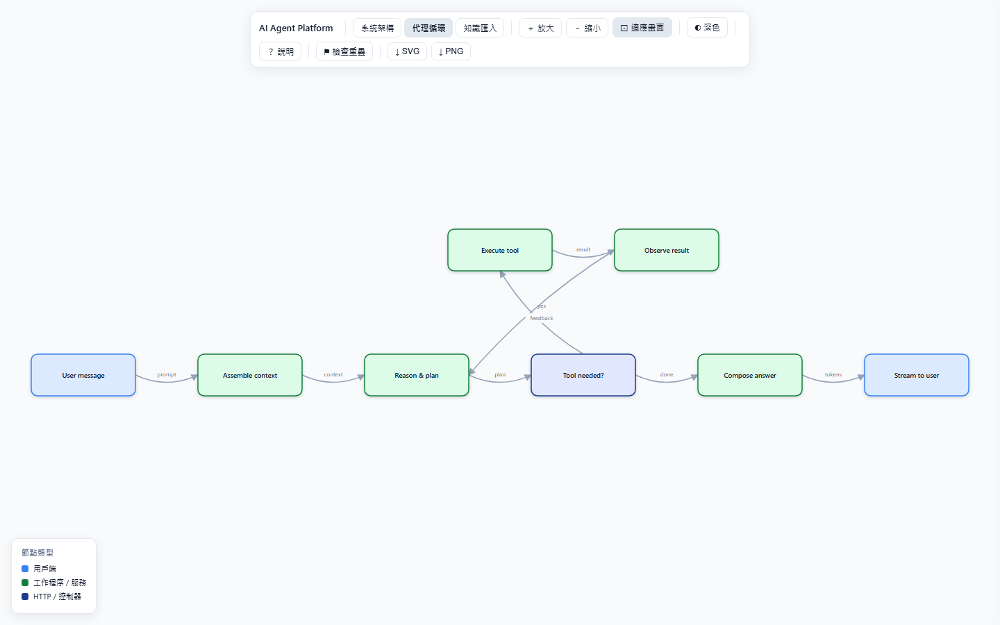

# Interactive Diagram

A Claude [skill](https://code.claude.com/docs/en/skills) / [plugin](https://code.claude.com/docs/en/plugins) that turns a description of a system into a **beautiful, interactive diagram** — delivered as a single self-contained `.html` file you open by double-clicking. No frameworks, no build step, no server, no CDN.

System architecture, sequence, and flow diagrams that you can **pan, zoom, drag, and explore** — with a baked-in layout guard that keeps everything from overlapping.

## Preview

The shots below are the bundled [`samples/ai-agent-platform.html`](samples/ai-agent-platform.html) — a full AI-agent app (chat UI → gateway → agent core → tools & retrieval → data & model providers) — opened straight in a browser.

| Architecture (light) | Architecture (dark) |
| --- | --- |
|  |  |

| Click → details panel + chain highlight | Agent loop tab |
| --- | --- |
|  |  |

## Install

With the [`skills`](https://github.com/vercel-labs/skills) CLI (works with Claude Code, Cursor, and other agents):

```bash
npx skills add LizardLiang/interactive-diagram
```

Or as a Claude Code plugin marketplace:

```text
/plugin marketplace add LizardLiang/interactive-diagram
/plugin install interactive-diagram@lizard-skills
```

Once installed, just ask your agent to "draw a diagram of …" / "visualize this architecture" and the skill triggers automatically.

## What you get

- **One file, zero dependencies** — pure HTML + CSS + vanilla JS. Open it in any browser; share it as a single attachment.
- **Tabbed multi-view** — one file can hold several related diagrams (e.g. *Architecture*, *Agent loop*, *Knowledge ingestion*), switchable from a floating toolbar. A single-view file hides the tab strip.
- **Layout guard** — a per-tab engine that resolves overlap across four element categories (blocks, edge labels, container titles, container rectangles) and can **audit** the result. Found overlaps can be **auto-fixed** with one click.
- **Rich interactions**
  - **Hover** a node → highlights its entire connected **chain** (upstream + downstream), dims the rest.
  - **Double-click** a node → **pins** the chain highlight; double-click again to unpin.
  - **Click** a node → details panel (description, tech, responsibilities).
  - **Drag** nodes, **drag** the canvas to pan, **scroll/pinch** to zoom, **Fit** to frame.
- **Dark mode** — Tokyo Night palette, one-attribute theme flip, remembered across reloads.
- **Export** — download the current view as **SVG** or **PNG** (2× for crispness).
- **Localized chrome** — the built-in UI ships in Traditional Chinese (zh-TW); diagram content is whatever you author.

## How it works

The skill starts from [`assets/skeleton.html`](assets/skeleton.html) — a complete, self-contained renderer. You (or the agent) edit **only the `app` config object** at the top of the script:

```js
const app = {
  title: "My System",
  tabs: [
    {
      id: "system", label: "System", type: "system",
      containers: [ { id: "client", label: "Client", orient: "band", color: "#7aa2f7" } ],
      blocks: [
        { id: "web", container: "client", type: "client", label: "Web App",
          description: "...", tech: ["React"], responsibilities: ["Render UI"] },
      ],
      edges: [ { from: "web", to: "api", label: "HTTPS", style: "sync" } ],
    },
  ],
};
```

The runtime builds the elements, runs the layout guard, and renders the SVG. See [`SKILL.md`](SKILL.md) for the full contract and [`samples/ai-agent-platform.html`](samples/ai-agent-platform.html) for a worked, three-tab example.

## Repository layout

```
.
├── SKILL.md                      # the skill (instructions + contract for the agent)
├── assets/skeleton.html          # the self-contained renderer (the starting point)
├── samples/ai-agent-platform.html # worked example: Architecture + Agent loop + Ingestion tabs
└── .claude-plugin/
    ├── plugin.json               # Claude Code plugin manifest
    └── marketplace.json          # single-plugin marketplace manifest
```

## License

[MIT](LICENSE)
